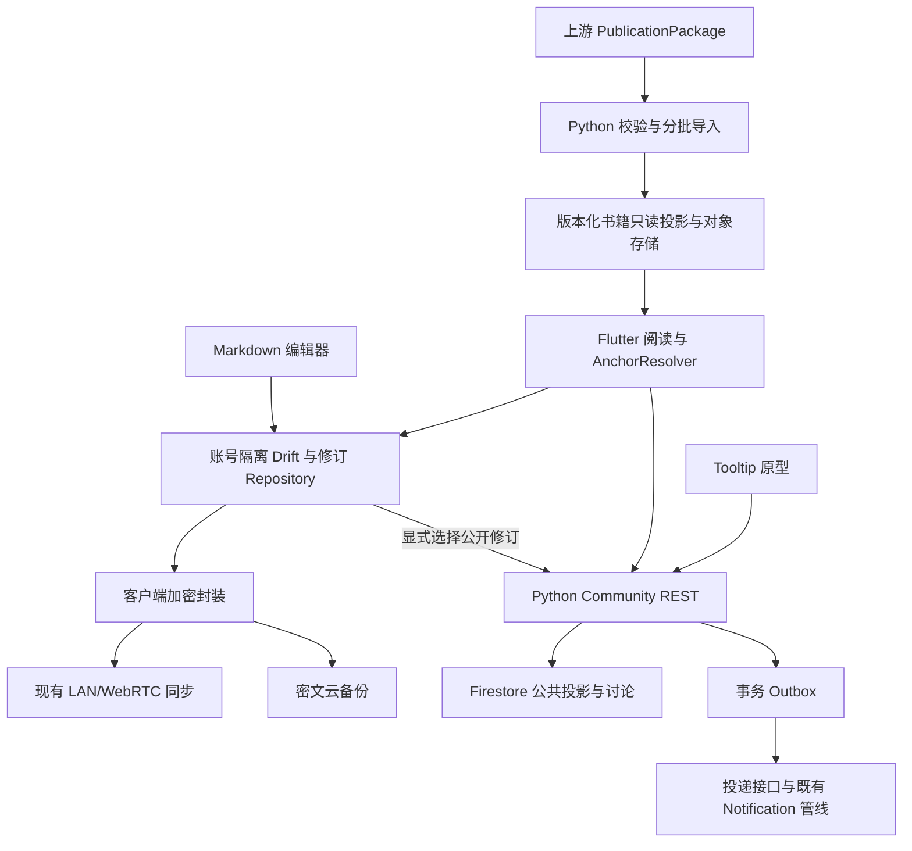

# 笔记、原句注解与讨论系统 Design

版本：1.0；2026-09-10。状态：`DESIGN_BASELINE_WITH_EXPLICIT_DEPENDENCIES`。
产品依据：[PRD](PRD.md)。本设计确定模块与业务规则；§10 的外部契约未冻结，相关任务不能越过依赖。接口名称/目录为本期工程设计，不表示已有实现。执行范围由 [Tasks](TASKS.md) 与工作包控制。

## 1. 架构与职责

- 学习功能模块拥有 Note/Annotation、修订、发布与讨论上下文，不修改黑箱知识源。
- xuan-storage 提供策略、通道、同步调度、加密组件和驱动；新增笔记 mapper 与生产接线，不复用明文 RecordOutboxMapper 传私人正文。
- social 提供可复用交互/关系/IM 端口；笔记模型不继承排盘专属 post 字段。
- notification 提供接收、补拉与 ACK 管线，业务负责事件、正文、投递、导航及宿主适配。
- Python 沿用 functions-py、Firebase 身份与 Firestore；对象字节沿用现有对象存储。公共业务写入只走鉴权命令，禁止客户端直接修改发布指针/通知集合。

## 2. 领域模型与身份

UGC 使用不透明稳定 ID，生成器沿用既有 UUID 能力；不占用上游 art/rev/rel 语义。时间用 UTC：私人本地修订记录设备时间与来源设备，不用于跨设备胜负；公开排序/审计时间由服务器生成。

| 对象 | 最小字段 | 不变量 |
|---|---|---|
| Note | id, owner_scope, kind(note/annotation), head_revision_ids, preferred_head_id, lifecycle, created_at | 本地权威私人头；并发时允许多头，不用 last-write-wins 删除分支 |
| NoteRevision | id, note_id, parent_ids, title, markdown, attachment_refs, mentions, bindings, content_hash, change_summary, restored_from, created_at | 不可变；根 parent 为空；合并可多 parent；所有敏感字段在备份密文内 |
| Publication | id, content_id, published_revision_id, public_snapshot_ref, state, version, published_at | 只包含选定可公开快照，不暴露私人父链；同 content_id 保持讨论身份 |
| ContentAccess | content_id, author_id, visibility, lifecycle, moderation_state, current_publication_id, version | 公共访问和事务冲突协调记录；私人笔记未发布时无需上传明文容器 |
| ContentBinding | content_id, revision_id, target_kind, target_ref, relation | 公共关联索引仅来自当前 publication，私人草稿关联不公开 |
| AnchorRef | anchor_id, target_type, entity_id, artifact_revision_id, release_id, context, selector | 固定创建时原文身份；D-06 决定正式目标白名单 |
| AnchorResolution | anchor_id, target_release, state, targets, mapping_ref, reason | 解析结果另存，不覆盖原始 AnchorRef |
| Thread | id, subject_kind, canonical_subject_key | 两入口共用；同主体原子去重，跨 Edition 不按同文自动合并 |
| Comment | id, thread_id, root_id?, reply_to_id?, depth(0/1), author_id, current_revision_id, observed_publication_id?, status, version | 回复必须同 thread/root；允许回复楼内对象但不增加深度 |
| CommentRevision | id, comment_id, body, mentions, parent_id?, created_at | 编辑留痕；删除/审核不能通过历史接口泄漏正文 |
| Reaction | target_type, target_id, actor_id, value(like/dislike), version | 同目标同账号唯一；none 表示无当前反应，变更事件可追溯 |
| Bookmark / ShareLink | actor_id + target；share_id + target + revoked_at | 收藏个人可见；分享仅定位，不授予额外读取权 |
| BackupManifest | backup_id, scope, protocol_version, encrypted_manifest_ref, object_refs, completeness, key_epoch | 外层最少元数据；完整依赖就绪后可恢复；密钥协议由 NC-015 冻结 |
| Delivery | delivery_id, event_id, recipient_id, target, delivery_state | event+recipient 唯一；ACK ID 与业务事件 ID 分开 |

内容 hash 按固定版本编码后的标题/Markdown/引用/附件/mention 计算，不对原书文字再做规范化；具体 canonical 编码在 NC-002 定义并给跨端 fixture。NoteRevision 恢复旧内容仍产生新 ID，即使正文 hash 与历史相同。

## 3. 本地保存、撤销与历史

编辑会话保存 `EditorSnapshot(text, selection, composing, attachmentRefs, mentionRefs)`。优先用 Flutter 已有文本控制与撤销机制；格式/图片/@ 操作用薄命令适配维护整体快照，不自建另一套富文本引擎。

状态：`clean → dirty → saving → clean`；失败为 `save_failed`，保留未保存内容并允许重试。2 秒去抖；失焦/退出 flush。IME composing 尚未提交时不将半成品当最终修订，返回时先请求完成输入；无法完成则保持编辑页和未保存提示。突发进程终止可能丢失尚未到保存点的输入，不能伪称逐键持久化。

本地事务：新增 NoteRevision → 更新 Note 的头和附件引用 → 记录待同步操作。失败三者回滚；公共 publication 不参与这个事务。无变化保存不新增版本；恢复历史是显式新修订。串行队列只合并未持久的重复保存请求，不能删除已保存历史。

### 3.1 本期 Undo/Redo

- 映射严格遵守 PRD §4；只在编辑器拥有焦点且输入法未消费按键时响应，不注册新的全局快捷键。
- 相邻同类输入在平台合理事务组内合并；光标跳转、粘贴、工具栏和图片插入建立操作边界。中文组合输入完成一次作为一个编辑步骤。
- Undo/Redo 同时恢复文本、光标及结构化引用；界面按钮与按键调用同一操作，不能两个撤销栈重复执行。
- 撤销后输入/粘贴/格式变更产生新分支，清空 redo；自动保存和备份成功不清栈。
- 图片 Undo 只移除当前引用；尚被历史引用的对象仍保留。会话关闭后释放内存栈；永久历史仍在。
- 撤销产生的正文变化照常自动保存为新修订，不撤回已发布版本，不取消已确认的服务端操作。
- **完整键盘交互设计当前缺失，仅在后续 F-01 登记；本稿不设计其他快捷键、导航或配置系统。**

### 3.2 并发与身份隔离

同步收到不同 head 保留两条分支，用户选择当前、另一版或手动合并，创建含相关 parent_ids 的新修订；正文自动合并不是本期要求。公共更新单独以公共 ETag 校验，不根据设备时钟抢占。

账号切换：flush 原账号编辑 → 停止其任务/关闭库与密钥句柄 → 启动新账号。异步完成回调核对 session generation 与 scope；旧响应不能写入新账号。设备吊销禁止新同步帧，但不承诺擦除设备已解密持有的字节。

## 4. 发布、权限与删除

发布状态独立于私人 head：`never_published / published / withdrawn`；生命周期 `active / trashed / purge_pending / purged`；审核 `allowed / hidden`，不以一个布尔值承担全部职责。

| 操作 | 前置条件 | 原子变化 |
|---|---|---|
| publish/update | 本人、选定修订已保存、图片已就绪；更新符合公共 ETag | 写公开快照/发布记录、当前指针、公共绑定、事件；不公开全部私人历史 |
| withdraw | 本人、当前版本一致 | 关闭 ContentAccess；后续读写即时拒绝；异步索引清理不成为 ACL 的唯一防线 |
| comment/reply | 当前主题可读可写、未受拉黑限制、root/target 合法 | 事务读取主题权限版本，写评论/修订/计数/outbox；与收回竞争同权限记录 |
| edit/delete comment | 作者或既有审核权限、版本一致 | 新修订或墓碑；删除后保留回复结构，不恢复被隐藏正文 |
| trash | 本人；曾公开需服务器确认收回 | 私人移入 30 天回收站、传播 tombstone；离线显示待收回而不是他人不可见 |
| restore | 本人在期限内、未 purge | 新恢复事件并保持 private；不自动重新公开 |
| purge | 到期或本人明确彻底删除 | 可重试删除任务，清除正文/引用/无其他引用的附件及备份，最小无正文 tombstone 防旧设备复活 |

只读权限：本人可看私人完整历史；其他人仅看当前仍公开且审核允许的发布历史。收回或隐藏后，正文、历史、附件、分享、关联列表和通知正文均重新检查 ContentAccess。拉黑沿用双向互动限制，不声称阻止截图或账号外持有。

删除一级评论保留墓碑和已有楼内回复；本期不允许对被删除 root 新建回复，也不允许回复已删除目标。评论编辑保留原始 created_at，排序不因编辑跳动。

回收站 30 天从权威 trash 事件计；仅本地笔记由本地持久事件起算，同步冲突不提前触发不可逆清理。离线设备超过 tombstone 保留窗口须全量对账再推送；具体窗口/epoch 协议由 NC-015 冻结。永久清理未完成不标 purged。用户私人永久删除与公共审核审计记录分域，最小审计不得留私人正文。

## 5. 图片、存储与加密

本地 Drift 保存私人业务行、版本和索引；对象文件保存图片；公共缓存与私人数据分表/分 scope。每个私有 entityType 注册 private 策略；公开投影独立 shared 策略。既有 row mapper 明文序列化不可直接复用。

私人图片 Markdown 用内部 `attachment://<id>`，resolver 在账号范围内取文件/解密；公共发布生成独立授权资源引用。原始 HTML 不执行；外部图片在私密预览默认不自动请求，用户显式加载。服务器不自动抓取任意远程 URL。

公共媒体使用每次重新鉴权的访问入口，不能返回脱离 ACL 的永久地址；短期签名 URL 未过期仍能访问，故不能作为“立即撤权”实现。私人密文备份和书籍下载各有独立资源策略。

设备同步：既有 LAN/WebRTC + 实际同账号授权/签名/指纹/epoch 校验 → 密文/授权会话传输 → 去重应用。类名 SameAccountSessionGuard 不是授权证据；当前 guard 存在未比较设备 ID/指纹等缺口，必须在接线验收处理。

云备份：首次选择 → 客户端加密 → 登记对象 → 上传密文 → 检验依赖 → 完整 manifest 激活 → 显示已备份。服务器只验证密文哈希/对象闭合，客户端解密后验证语义。P2P 中转、公开媒体孤儿清理和长期备份不共享生命周期。

关闭备份停止新上传；删除云备份单独确认范围并生成任务。密钥恢复不能依赖已丢失设备的唯一 DEK，不能把服务器持有明文恢复密钥称 E2EE。方案与真实“全旧设备丢失”恢复证据由 NC-015/018 提供，未通过不得宣称完整备份可用。

## 6. 社交、通知与 Tooltip

两级评论按 `(created_at,id)` 排序；一级默认倒序、支持正序，楼内正序。一级与每楼分页独立，不无限嵌套或一次取全。公共计数为可重建投影，同目标同账号 reaction 唯一；命令传最终状态而不是盲目 +1/-1。

@ 选择候选后保存账号 ID、显示名与文本对应关系；编辑导致标记不再有效则取消 mention 关系。手打普通 @ 文本不自动变为收件人。新发表/编辑新增的有效 mentions 才产生相应事件，重复保存相同 mention 不反复提醒。

通知：业务事务 outbox → `(event_id,recipient_id)` 原子投递记录 → 持久投递尝试 → Notification 接收管线。作者/回复对象/@ 重叠合并；不通知自己；按拉黑、当前权限与偏好过滤。赞站内通知，系统提醒按偏好；踩、收藏、分享默认无作者通知。公共发布中的 @ 同样检查权限；私人保存永不触发。

实时、唤醒正文拉取和游标补拉共用可靠落盘管线；落盘失败不 ACK、不推进游标。ACK 不等于已读。`ReceiptRejected` 当前行为整批结束并报告，HTTP→Outcome 映射在契约任务明确；不能照抄相互矛盾的文档。系统推送沿用无正文唤醒，点击重新鉴权。

Tooltip 原型在独立运行宿主中接真实 REST：来源摘要 → 注解/笔记 → 两级讨论 → 回复/@ → 互动与资料/私信 → 接收通知 → 定位楼内评论。输入 `DiscussionContext` 含规范目标、所见修订与可选 selector；输出 `DiscussionView` 含 thread_id、当前 publication、作者、计数、viewer 状态、capabilities 和分页。capabilities 只控制 UI，服务端每次重新鉴权。

普通独立笔记详情不依赖 AnchorResolver；源句与知识主题须取得权威关联。未有书籍协议可用时不能用引文模糊匹配冒充真实 Tooltip 端到端验收。

## 7. REST 与 Schema 工程基线

使用现有 `/v1` 风格、Bearer 身份、Problem Details、游标、幂等与版本机制；逻辑操作清单如下，最终 OpenAPI 在 NC-003 输出并校验。范围内集合字段不直接成为可任意写入的通用客户端数据库 API。

| 资源/操作 | 请求要点 | 响应与失败 |
|---|---|---|
| content publish/update/withdraw/trash/restore | ID、选定公共快照/资源、Idempotency-Key、更新时 If-Match | publication/access/version；版本失败保留私人稿，禁止静默覆盖 |
| content list/detail/history/bindings | 当前身份、目标、sort、cursor、limit | 仅当前可读发布记录；每页受 ACL |
| thread/comment create/edit/delete | thread/root/reply_to、正文、mentions、observed publication；编辑前置版本 | 评论/墓碑、ETag、权威计数 |
| reaction/bookmark set | target、最终 value 或布尔状态、幂等键 | 当前状态与计数；幂等同键异载荷冲突 |
| share create/resolve/report | 目标、原因（举报） | 受 ACL 定位或报告结果，不含永久正文权限 |
| backup begin/complete/download/delete | 认证 scope、不透明对象/备份 ID、密文 hash/大小/依赖 | 上传会话、完整状态、授权密文下载或清理任务 |
| notification body/backfill/receipt/read | delivery ID、游标、ACK 批次 | 当前接收人投递与结果；协议匹配 Notification 端口 |
| library import/validate/activate/query/resolve | release/manifest/hash、对象集合、固定修订 | 导入状态、报告、固定版阅读数据或明确不可用原因 |

每次重试保持同一键；用户新动作新键。快速赞踩按目标串行/合并最新待发状态，旧重试不得压过新选择。API 验证 Firebase UID 映射 app_user_id/scope，不能信任客户端 owner/path，也不能假设几种 ID 相等。

工程默认值（集中配置并由 NC-002/003 固化测试）：笔记 Markdown UTF-8 最大 1 MiB；超过 256 KiB 的公开正文放不可变对象而非大 Firestore 行；评论最多 4,000 code points；每修订最多 20 张图片、单张 10 MiB；单次提交最多 50 个有效 mention；列表默认 20/上限 100。无静默截断；超限保留本地缓冲并返回可理解错误。原书 JSONL 分片上限独立由书籍共同契约确定。

错误基线：未认证 401；禁止访问 403 或统一不泄漏存在性的 404；不存在/失效 404；If-Match 不匹配 412；业务/幂等冲突 409；输入错误 400；体积超限 413；限流 429；暂时不可用 503。客户端按统一 code 处理，不能只判断消息字符串。私有备份涉及密码学字段的精确类型由 NC-015 补齐后进 OpenAPI。

OpenAPI 必须用 header parameters 表示请求头；现有 operation.headers 形式不能原样复制。Swagger UI 与客户端契约测试消费同一权威文档，JSON Schema 不维护第二套含义相反的字段。校验器通过仍不替代真实 HTTP 测试。

## 8. 书籍导入与锚点

导入 `received → validating → ready → active`；失败 rejected，替换后旧版 retained。隔离写入、校验对象/引用/发布级别/报告/能力，再原子切换作用域内 active 指针；一次查询固定 Release。新包失败不影响旧版。

上游负责解码、正文/目录/脚注/图片映射与稳定身份，Python 只装载。Source/Edition/Asset 不合并身份；传输分片不改变 TextBlock/offset。原件与派生资产档位和 packaged/already_stored 分开，缺能力明确标识。

selector 候选为有序 ranges，每段固定 block_id/artifact_revision_id/text_hash/[start,end)，建议 Unicode code point/冻结文本 UTF-8 SHA-256；必须由 D-06 与 Python/Dart 样例冻结，不可自行去空格或繁简转换。旧 AnchorRef 保留，迁移解析另存，拆分歧义不自动猜。

原生 EPUB/TXT 正式发布与当前 glyphbox_level/OcrPage 强制规则冲突，须上游改政策及验证器后方可 PUBLIC_RELEASE。无语义 SourceSpan 正文需合法结构锚点；不伪造 Span。QueryContractPack/SchoolViewPack 不由阅读协议取代。

## 9. 测试与可观测性

- 单元/Widget：保存、Undo/Redo/IME/焦点、版本分支、图片引用、权限状态、两级排序。
- 契约：Python/Dart 同一 fixture；Schema 正反例；If-Match/幂等/排序游标/格式大小；真实 HTTP 请求而非调用 Fake 方法代替。
- 集成：Drift 真文件重启、两设备授权同步、云端密文上传下载与恢复、Firestore 并发权限/投递事务、Notification 补拉/ACK。
- 端到端：独立笔记与源句两条纵向链路；收回后正文/历史/图片/分享/通知全入口拒绝新访问。
- 可观测字段仅用事件/操作 ID、耗时、状态、失败类别；日志不得含私人标题/正文/引文/密钥/完整敏感路径。
- 不以 Fake、文件存在、固定关键词或只有成功路径的测试声明验收通过。

## 10. 依赖与设计变更登记

| 依赖 | 冻结责任任务 | 阻断范围 |
|---|---|---|
| 客户端实际目录/导出/宿主/SDK 版本 | NC-001 | 客户端代码工作包的派发 |
| 公共 DTO/工程限额/OpenAPI 与错误映射 | NC-002/003 | 公共实现契约，独立本地模型可先准备 |
| 恢复密钥/设备授权/清理窗口 | NC-015 | 私人跨设备同步、完整备份及永久清理上线 |
| 书籍 Schema/发布规则/D-06/样例 | NC-020 | 书籍导入/原句与真实关联 Tooltip 验收 |
| D-07/D-08 知识查询/流派 | 既有上游任务，由 NC-020 登记 | 需要该关系的知识入口，不阻断独立笔记 |

本期完整键盘方案不是阻断项，而是明确未做的后续 F-01。进一步工程方案若改变 PRD 可见性/数据安全/删除语义，须作为显式变更记录；不由执行 Agent 临时决定。
