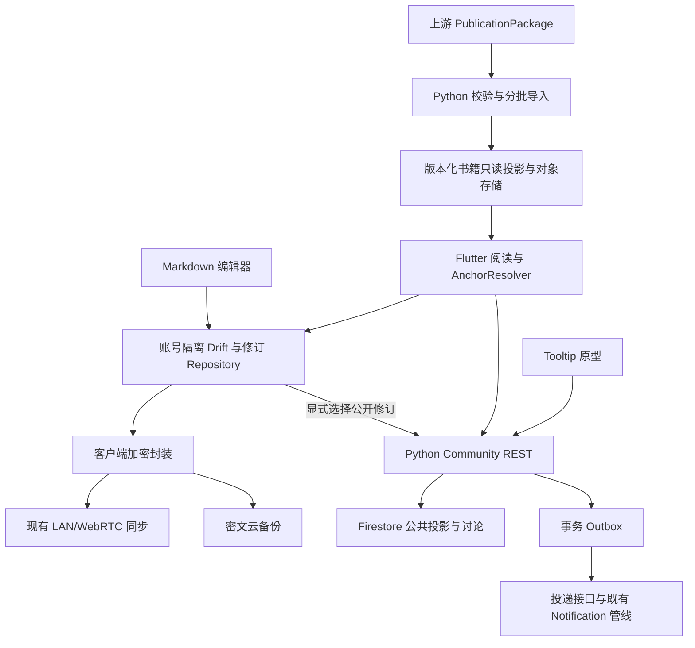

# 笔记、原句注解与讨论系统 Design

版本：1.1；2026-09-10（R1 四角色审查后修订）。状态：`APPROVED_DESIGN`；执行状态：`NOT_STARTED`。
产品依据：[PRD](PRD.md)；执行顺序 [Plans](PLANS.md)；审查缺陷登记 [REVIEW_R1](REVIEW_R1.md)。本设计确定模块与业务规则；§10 的外部契约未冻结，相关任务不能越过依赖。接口名称/目录为本期工程设计，不表示已有实现。执行范围由 [Tasks](TASKS.md) 与工作包控制。

## 1. 架构与职责（覆盖 R-18）



- 学习功能模块拥有 Note/Annotation、修订、发布与讨论上下文，不修改黑箱知识源。
- xuan-storage 提供策略、通道、同步调度、加密组件和驱动；新增笔记 mapper 与生产接线，不复用明文 RecordOutboxMapper 传私人正文。
- social 提供可复用交互/关系/IM 端口；笔记模型不继承排盘专属 post 字段。
- notification 提供接收、补拉与 ACK 管线，业务负责事件、正文、投递、导航及宿主适配。
- Python 沿用 functions-py、Firebase 身份与 Firestore；对象字节沿用现有对象存储。公共业务写入只走鉴权命令，禁止客户端直接修改发布指针/通知集合。

## 2. 领域模型与身份（覆盖 R-04, R-08, R-09, R-12, R-13）

UGC 使用不透明稳定 ID，生成器沿用既有 UUID 能力；不占用上游 art/rev/rel 语义。时间用 UTC：私人本地修订记录设备时间与来源设备，不用于跨设备胜负；公开排序/审计时间由服务器生成。

| 对象 | 最小字段 | 不变量 |
|---|---|---|
| Note | id, owner_scope, kind(note/annotation), head_revision_ids, preferred_head_id, lifecycle, created_at | 本地权威私人头；并发时允许多头，不用 last-write-wins 删除分支 |
| NoteRevision | id, note_id, parent_ids, title, markdown, attachment_refs, mentions, bindings, content_hash, change_summary, restored_from, created_at | 不可变；根 parent 为空；合并可多 parent；所有敏感字段在备份密文内 |
| Publication | id, content_id, published_revision_id, public_snapshot_ref, state, version, published_at | 只包含选定可公开快照，不暴露私人父链；同 content_id 保持讨论身份 |
| ContentAccess | content_id, author_id, visibility, lifecycle, moderation_state, current_publication_id, version | 公共访问和事务冲突协调记录；私人笔记未发布时无需上传明文容器 |
| ContentBinding | content_id, revision_id, target_kind, target_ref, relation | 公共关联索引仅来自当前 publication，私人草稿关联不公开 |
| AnchorRef | anchor_id, target_type, entity_id, artifact_revision_id, release_id, context, selector | 固定创建时原文身份；D-06 决定正式目标白名单 |
| AnchorResolution | anchor_id, target_release, state`(resolved/ambiguous/missing/degraded)`, targets, mapping_ref, reason | 解析结果另存，不覆盖原始 AnchorRef |
| Thread | id, subject_kind, canonical_subject_key | 两入口共用；同主体原子去重，跨 Edition 不按同文自动合并 |
| Comment | id, thread_id, root_id?, reply_to_id?, depth(0/1), author_id, current_revision_id, observed_publication_id?, status`(visible/deleted/hidden)`, version | 回复必须同 thread/root；允许回复楼内对象但不增加深度 |
| CommentRevision | id, comment_id, body, mentions, parent_id?, created_at | 编辑留痕；删除/审核不能通过历史接口泄漏正文 |
| Reaction | target_type, target_id, actor_id, value`(like/dislike)`, client_seq, version | 同目标同账号唯一；**取消即删除该行**，API 统一以 `viewer_reaction: like\|dislike\|null` 表达，不引入第三个枚举值；`client_seq` 单调递增用于乱序重试判定 |
| Bookmark / ShareLink | actor_id + target；share_id + target + revoked_at | 收藏个人可见；分享仅定位，不授予额外读取权 |
| BackupManifest | backup_id, scope, protocol_version, encrypted_manifest_ref, object_refs, completeness, key_epoch | 外层最少元数据；完整依赖就绪后可恢复；密钥协议由 NC-015 冻结 |
| Delivery | delivery_id, event_id, recipient_id, target, delivery_state`(created/dispatching/delivered/failed/abandoned)`, attempt_count | event+recipient 唯一；ACK ID 与业务事件 ID 分开 |

内容 hash 按固定版本编码后的标题/Markdown/引用/附件/mention 计算，不对原书文字再做规范化；具体 canonical 编码在 NC-002 定义并给跨端 fixture。NoteRevision 恢复旧内容仍产生新 ID，即使正文 hash 与历史相同。

### 2.1 UGC 标识格式（需用户确认后冻结）

沿用仓库既有范式（[learn-system-blackbox-architecture](../learn-system-blackbox-architecture.md) §8.1 第 3 节：新对象标识格式须由用户确认并冻结，且给出非法格式可判定规则）。本期新增 15 类对象的前缀如下，与上游 `art_/rev_/rel_/pr_/prun_` 全部不冲突：

| 对象 | 前缀 | 完整形式 |
|---|---|---|
| Note | `note_` | `note_<32 位小写 hex>` |
| NoteRevision | `nrev_` | `nrev_<32 hex>` |
| Publication | `pub_` | `pub_<32 hex>` |
| ContentAccess | `cacc_` | `cacc_<32 hex>` |
| ContentBinding | `cbnd_` | `cbnd_<32 hex>` |
| AnchorRef | `anc_` | `anc_<32 hex>` |
| AnchorResolution | `ares_` | `ares_<32 hex>` |
| Thread | `thr_` | `thr_<32 hex>` |
| Comment | `cmt_` | `cmt_<32 hex>` |
| CommentRevision | `crev_` | `crev_<32 hex>` |
| Reaction | `rct_` | `rct_<32 hex>` |
| Bookmark | `bmk_` | `bmk_<32 hex>` |
| ShareLink | `shr_` | `shr_<32 hex>` |
| BackupManifest | `bkm_` | `bkm_<32 hex>` |
| Delivery | `dlv_` | `dlv_<32 hex>` |

非法格式判定（每条须有 fixture 负例）：① 前缀不在上表；② hex 段长度 ≠ 32；③ 含大写或非 hex 字符；④ 使用上游保留前缀 `art_/rev_/rel_/pr_/prun_`；⑤ 前缀与所在集合不匹配（例如 `thread_id` 字段收到 `cmt_` 开头的值）。

`nrev_` 与上游 `rev_` 仅差一个字母，属刻意区分：判定 ④ 必须显式覆盖「`rev_` 被误用作 NoteRevision」这一负例。

**冻结状态：待用户确认。** 未确认前 NC-002 不得离开 `PREPARING`。

### 2.2 状态机总览

六台状态机的完整转移表在 NC-002 产出 `SPEC/contracts/state-machines.md`，每条边标注触发事件、前置条件与失败错误码。本节固定枚举与关键不变量，BDD 场景按边生成、覆盖率机械核对。

| 状态机 | 枚举 | 定义位置 |
|---|---|---|
| 编辑态 | `clean / dirty / saving / save_failed / ime_composing` | §3 |
| 发布态 | `never_published / published / withdrawn`（ContentAccess）；`draft / live / superseded / retracted`（Publication 记录） | §4 |
| 生命周期 | `active / trashed / purge_pending / purged` | §4 |
| 审核态 | `allowed / hidden` | §4 |
| 客户端待办 | `none / withdraw_pending / trash_pending / purge_pending / purge_failed` | §4 |
| 投递态 | `created / dispatching / delivered / failed / abandoned` | §6 |
| 导入态 | `received / validating / ready / active / rejected / retained` | §8 |
| 锚点解析 | `resolved / ambiguous / missing / degraded` | §8 |

`never_published` 属 ContentAccess.visibility 的派生表达，不是 Publication 记录的状态：内容从未发布时不存在 Publication 行。

## 3. 本地保存、撤销与历史（覆盖 R-02, R-03, R-04, R-12）

编辑会话保存 `EditorSnapshot(text, selection, composing, attachmentRefs, mentionRefs)`。

**撤销栈归属（本版裁定，消除「复用平台栈」与「新增 adapter」的冲突）：** 采用方案 (b)——`editor_history_adapter` 持有唯一真源栈，Flutter 平台 `UndoHistory` 在编辑器内被显式禁用（`TextField.undoController` 接管），避免双栈同时响应同一按键。adapter 对外暴露 `canUndo / canRedo / undoCount / redoCount`，界面按钮与快捷键调用同一入口。格式/图片/@ 操作用薄命令适配维护整体快照，不自建另一套富文本引擎。「不双撤销」的可观察断言：按下一次 Ctrl+Z，`undoCount` 增加 1 且文本仅回退一个 undo 单元。

编辑态为封闭枚举 `clean / dirty / saving / save_failed / ime_composing`，全部转移如下（含非法转移的期望），BDD 按边生成场景：

| 当前态 | 事件 | 目标态 | 说明 |
|---|---|---|---|
| clean | onTextChanged | dirty | 启动 2 秒去抖计时 |
| dirty | 去抖到期 / 失焦 / 返回 | saving | flush |
| dirty | 应用被杀 | （无承诺） | 不伪称逐键持久化 |
| saving | 持久化成功 | clean | 无内容变化则不新增修订 |
| saving | 持久化失败 | save_failed | 保留缓冲，**不清 undo 栈** |
| saving | onTextChanged | saving（置 `pending_dirty`） | 本次保存完成后立即再触发一次 |
| save_failed | onTextChanged | save_failed（内容更新） | **不自动重试** |
| save_failed | 点击重试 / 失焦 / 返回 | saving | 用户或生命周期触发 |
| save_failed | 用户选择「复制全文」后离开 | save_failed（保留） | 内容不丢弃 |
| clean/dirty | IME 开始组合 | ime_composing | 半成品不当最终修订 |
| ime_composing | 组合提交 | dirty | 整段组合作为一个编辑步骤 |
| ime_composing | 返回且无法完成输入 | ime_composing | 保持编辑页与未保存提示，不允许离开 |

`save_failed` 时 UI 呈现 §6.1「保存失败」，提供「立即重试」与「复制全文」。磁盘失败回滚后编辑态为 `save_failed`，且不产生半个 head 或 outbox 行。突发进程终止可能丢失尚未到保存点的输入。

本地事务：新增 NoteRevision → 更新 Note 的头和附件引用 → 记录待同步操作。失败三者回滚；公共 publication 不参与这个事务。无变化保存不新增版本；恢复历史是显式新修订。串行队列只合并未持久的重复保存请求，不能删除已保存历史。

### 3.1 本期 Undo/Redo

- 映射严格遵守 PRD §4；只在编辑器拥有焦点且输入法未消费按键时响应，不注册新的全局快捷键。
- **归组规则（可判定，不委托给平台默认实现）：** 同一编辑会话内，连续插入且同时满足 ①相邻两次输入间隔 < 500 ms ②未跨越空白或换行 ③本单元累计 ≤ 20 字符，三条全满足才合并为一个 undo 单元；任一条不满足即开新单元。粘贴、工具栏格式、图片插入、@ 插入、光标跳转**无条件开新单元**。删除操作按同规则独立归组，不与插入合并。中文 IME 一次组合提交整体作为一个编辑步骤，不按拼音键拆分。
- 上述阈值集中配置并由 NC-002 固化为测试常量；示例断言：空编辑器以 100 ms 间隔依次输入 `a`、`b`、`c` 后按一次 Ctrl+Z，文本为空串且 `canRedo=true`、`canUndo=false`。
- Undo/Redo 同时恢复文本、光标及结构化引用；界面按钮与按键调用同一操作，不能两个撤销栈重复执行。
- 撤销后输入/粘贴/格式变更产生新分支，清空 redo；自动保存和备份成功不清栈。
- 图片 Undo 只移除当前引用；尚被历史引用的对象仍保留。会话关闭后释放内存栈；永久历史仍在。
- 撤销产生的正文变化照常自动保存为新修订，不撤回已发布版本，不取消已确认的服务端操作。
- **完整键盘交互设计当前缺失，仅在后续 F-01 登记；本稿不设计其他快捷键、导航或配置系统。**

### 3.2 并发与身份隔离

同步收到不同 head 保留两条分支，用户选择当前、另一版或手动合并，创建含相关 parent_ids 的新修订；正文自动合并不是本期要求。公共更新单独以公共 ETag 校验，不根据设备时钟抢占。

账号切换：flush 原账号编辑 → 停止其任务/关闭库与密钥句柄 → 启动新账号。异步完成回调核对 session generation 与 scope；旧响应不能写入新账号。设备吊销禁止新同步帧，但不承诺擦除设备已解密持有的字节。

## 4. 发布、权限与删除（覆盖 R-05, R-14, R-16, R-20）

发布状态独立于私人 head：`never_published / published / withdrawn`；生命周期 `active / trashed / purge_pending / purged`；审核 `allowed / hidden`，不以一个布尔值承担全部职责。三者正交但组合并非全部合法。

### 4.1 状态组合白名单

3×4×2 共 24 个组合中，仅下列合法；其余组合视为数据损坏，读取时按 `500` 并告警，写入时拒绝。

| publish_state | lifecycle | moderation | 合法 | 说明 |
|---|---|---|---|---|
| never_published | active | allowed | ✔ | 私人草稿 |
| never_published | trashed / purge_pending / purged | allowed | ✔ | 从未公开的删除链 |
| published | active | allowed / hidden | ✔ | 公开中；hidden 为审核暂停 |
| withdrawn | active | allowed / hidden | ✔ | 已收回但仍在我的笔记中 |
| withdrawn | trashed / purge_pending / purged | allowed / hidden | ✔ | 收回后删除链 |
| published | trashed / purge_pending / purged | 任意 | ✘ | trash 前置要求服务器已确认收回，见下 |
| never_published | 任意 | hidden | ✘ | 未公开内容不进入审核域 |

- `withdrawn → published`（重新发布）**允许**，产生新的 Publication 记录且沿用同一 `content_id`，讨论身份不变；publish 的前置条件补一条「当前 lifecycle 必须为 `active`」。
- `purge_pending` **不算**「未 purge」，`restore` 在该状态下拒绝并返回 `409 conflict.lifecycle`。
- `hidden` 内容被作者 `restore` 后**仍为 hidden**；审核态只由审核角色改变，作者操作不清除它。
- 非法转移一律 `409 conflict.lifecycle`，且内容状态不变。

### 4.2 客户端待办态 `pending_op`

`withdraw / trash / purge` 在服务端确认前，客户端持有独立字段 `pending_op ∈ {none, withdraw_pending, trash_pending, purge_pending, purge_failed}`。它是本地字段，不参与服务端状态机，也不改变他人可见性——正是 PRD §6.2「正在停止公开，他人可能仍可访问」的数据依据。`pending_op ≠ none` 的条目同时出现在 PRD 旅程 9 的「待处理」队列中。

### 4.3 操作、前置条件与原子边界

「原子」在本设计中**只指同一个 Firestore 事务内的写入**。跨对象存储、跨服务的部分一律为补偿型，须显式声明中间态可见性——现有 `functions-py/xuan/idempotency.py` 的注释已写明业务写入「刻意放在事务外」（因 Firestore 可能重跑事务回调），因此不能笼统声称四写同事务。

| 操作 | 前置条件 | 事务内（原子） | 事务外（补偿/顺序） | 中间态可见性 |
|---|---|---|---|---|
| publish/update | 本人、lifecycle=active、选定修订已保存、图片对象已全部上传完成、更新符合公共 ETag | 发布记录 + 当前指针 + 公共绑定 + outbox 事件 | 对象上传在事务**之前**完成并校验；失败的孤儿对象由清理任务回收 | 对象已存在但指针未提交时，对象不可经任何公共入口访问（无指针即无 ACL 授权） |
| withdraw | 本人、当前版本一致 | 关闭 ContentAccess + 提升 `ContentAccess.version` + outbox 事件 | 索引清理、缓存失效 | 索引清理未完成时读路径仍以 ContentAccess 为准，异步清理不作为 ACL 唯一防线 |
| comment/reply | 主题可读可写、未受拉黑限制、root/target 合法 | 读 `ContentAccess.version` + 写 comment + revision + 计数 + outbox | 幂等记录写入在事务外（沿用既有 `with_idempotency` 结构） | 见 §4.4 并发裁定 |
| edit/delete comment | 作者或既有审核权限、版本一致 | 新修订或墓碑 + 计数 | — | 删除后保留回复结构，不恢复被隐藏正文 |
| trash | 本人；曾公开需服务器**已确认**收回（`publish_state=withdrawn`） | lifecycle→trashed + trash 事件 | tombstone 传播、设备同步 | 服务端未确认前客户端 `pending_op=trash_pending`，显示「正在停止公开」 |
| restore | 本人、在 30 天内、lifecycle=trashed（`purge_pending` 拒绝） | lifecycle→active + 恢复事件 | — | 保持 private，不自动重新公开；moderation 不变 |
| purge | 到期或本人明确彻底删除 | lifecycle→purge_pending + 清理任务登记 | 可重试的正文/引用/附件/备份删除，全部成功后才 →purged | 未完成时 `pending_op=purge_pending`；失败为 `purge_failed` 并可重试。最小无正文 tombstone 防旧设备复活 |

### 4.4 并发裁定（本版写死，不留二选一）

- **收回 vs 评论**：withdraw 在事务中提升 `ContentAccess.version`；comment 事务以该 version 为前置读。冲突方一律失败，返回 `409 conflict.access_version`，客户端保留草稿并进入 PRD 旅程 9 的待处理队列。评论**不**先成功再随内容隐藏。
- **快速赞踩**：客户端维护单调递增 `client_seq` 并随幂等键上报；服务端仅接受 `client_seq > last_applied_seq`，否则不改值并返回当前状态。示例：连发 `like(seq=1)`、`none(seq=2)` 后，`seq=1` 的重试在 `seq=2` 之后到达，最终 `viewer_reaction=null`、计数不变，且该重试的响应体反映最终状态而非 like。
- 设备时钟不参与任何跨设备或跨请求胜负判定（§2 已定），并发裁定只用服务端 version 与 `client_seq`。

只读权限：本人可看私人完整历史；其他人仅看当前仍公开且审核允许的发布历史。收回或隐藏后，正文、历史、附件、分享、关联列表和通知正文均重新检查 ContentAccess。拉黑沿用双向互动限制，不声称阻止截图或账号外持有。

删除一级评论保留墓碑和已有楼内回复；本期不允许对被删除 root 新建回复，也不允许回复已删除目标。评论编辑保留原始 created_at，排序不因编辑跳动。

回收站 30 天的 T0 分两类，NC-019 的边界用例须分别构造：**曾公开的内容**从服务端 trash 事件的 `server_time` 起算；**从未公开的纯本地笔记**从本地持久 trash 事件时间起算，并在首次上线同步时以服务端时间校正（只允许推后，不允许提前）。同步冲突不提前触发不可逆清理。离线设备超过 tombstone 保留窗口须全量对账再推送；具体窗口/epoch 协议由 NC-015 冻结。永久清理未完成不标 purged。用户私人永久删除与公共审核审计记录分域，最小审计不得留私人正文。

## 5. 图片、存储与加密（覆盖 R-13, R-15, R-20）

本地 Drift 保存私人业务行、版本和索引；对象文件保存图片；公共缓存与私人数据分表/分 scope。每个私有 entityType 注册 private 策略；公开投影独立 shared 策略。既有 row mapper 明文序列化不可直接复用。

私人图片 Markdown 用内部 `attachment://<id>`，resolver 在账号范围内取文件/解密；公共发布生成独立授权资源引用。原始 HTML 不执行；外部图片在私密预览默认不自动请求，用户显式加载。服务器不自动抓取任意远程 URL。

公共媒体使用每次重新鉴权的访问入口，不能返回脱离 ACL 的永久地址；短期签名 URL 未过期仍能访问，故不能作为「立即撤权」实现。**票据 TTL 上限固定为 300 秒**，收回操作不吊销已签发的未过期票据——这是收回承诺的已知窗口，须在 PRD §5 末段的口径内如实说明，不得声称「立即撤权」。「每次调用返回新票据」不等于旧票据失效，R-20 的可测断言是：收回后**新的**取票据请求返回 404，而非旧票据立即失效。私人密文备份和书籍下载各有独立资源策略。

生产对象存储网关目前不存在：`xuan-storage/firebase/lib/media/blob_gateway_firebase.dart` 自述为内存 fake，「真云端实现未交付」。公共与私有两条链路的生产 BlobGateway 由 NC-025 专责实现，NC-008/NC-017 均以其为前置，禁止 import `InMemoryFirebaseBlobGateway` 充当生产实现。

设备同步：既有 LAN/WebRTC + 实际同账号授权/签名/指纹/epoch 校验 → 密文/授权会话传输 → 去重应用。类名 SameAccountSessionGuard 不是授权证据；当前 guard 存在未比较设备 ID/指纹等缺口，必须在接线验收处理。

云备份：首次选择 → 客户端加密 → 登记对象 → 上传密文 → 检验依赖 → 完整 manifest 激活 → 显示已备份。服务器只验证密文哈希/对象闭合，客户端解密后验证语义。P2P 中转、公开媒体孤儿清理和长期备份不共享生命周期。

关闭备份停止新上传；删除云备份单独确认范围并生成任务。密钥恢复不能依赖已丢失设备的唯一 DEK，不能把服务器持有明文恢复密钥称 E2EE。方案与真实“全旧设备丢失”恢复证据由 NC-015/018 提供，未通过不得宣称完整备份可用。

## 6. 社交、通知与 Tooltip（覆盖 R-07, R-08, R-09, R-10, R-11, R-19）

两级评论按 `(created_at, id)` 排序，`id` 按 UTF-8 字节序升序比较（跨端游标稳定性的唯一依据）；一级默认倒序、支持正序，楼内正序。一级与每楼分页独立，不无限嵌套或一次取全。公共计数为可重建投影，同目标同账号 reaction 唯一；命令传最终状态而不是盲目 +1/-1。

@ 以三元组 `(user_id, start_offset, length)` 持久化，同时记录创建时的 `display_name`。保存时逐条校验 `markdown.substring(start, start+length) == "@" + display_name_at_creation`，**不相等即解除该条 mention 关系**（部分删除、改字、整段删除都落入这一条判定）；同一昵称出现多处时按各自 offset 独立判定，删一处不影响另一处。手打普通 @ 文本不自动变为收件人。只有新增的有效 mention 才产生事件，重复保存相同 mention 不反复提醒。「无效 mention」在 fixture 中至少覆盖四类：user_id 不存在、账号已注销、已被目标拉黑、文本不再匹配。

通知：业务事务 outbox → `(event_id,recipient_id)` 投递记录 → 持久投递尝试 → Notification 接收管线。投递记录的 doc ID 必须由 `(event_id, recipient_id)` **确定性派生**（例如 `sha256(event_id + "/" + recipient_id)` 的前 32 hex），并以 create-if-absent 写入；并发双写第二次返回 already-exists。禁止照抄既有 `notifications.py` 的「先 query 查重 + 随机 doc ID」写法，那不是并发幂等实现。作者/回复对象/@ 重叠合并；不通知自己；按拉黑、当前权限与偏好过滤。赞站内通知，系统提醒按偏好；踩、收藏、分享默认无作者通知。公共发布中的 @ 同样检查权限；私人保存永不触发。

### 6.1 投递语义（本版显式声明）

- **Firestore trigger 为 at-least-once**（`functions-py/xuan/handlers/notifications.py` 已如此自述），**外部推送为 at-least-once**（`xuan-server/notifier/docs/OPENSPEC-PUSH-CELL.md` 已冻结「⛔ 永不声称 exactly-once」）。本设计中的「原子」仅指投递记录终态在同一事务内写入一次，**不构成端到端 exactly-once**。
- 用户可见的重复由**客户端按 `deliveryId` 去重**兜住，去重表保留窗口 **7 天**，与上游冻结口径一致。`notification` 包当前**尚未实现** `dedup_retention_ms`，该实现与其裁剪逻辑属 NC-014 必测项，并作为 E-DEDUP 依赖登记。
- ACK 被拒可能导致重复推送，属 at-least-once 允许行为，不视为缺陷。

### 6.2 notifier 与本系统的契约边界

`xuan-server/notifier` 是独立 Go 服务，持有权威 `api/openapi.yaml`（**OpenAPI 3.0.3**）；本系统的 REST 契约在 `repository-rest-adapter/openapi/openapi.yaml`（**3.1.0**）。两份文档版本不同且上游明令「权威副本仍在服务端，⛔ 不复制契约正文」，因此：

- `/receipts`（ACK）与 relay backfill 属 notifier 契约，本系统**只引用不复制**，不并入 3.1 那一份。
- `ReceiptRejected` 的 HTTP 映射由 notifier 冻结：`/receipts` **整批原子**，任一 id 校验失败则整批 4xx，且上游已答复「你无法区分具体原因」。因此 NC-013 不再承担「明确 ReceiptRejected 的 HTTP 映射」，改为在 NC-014 记录并遵守上游既有口径。`notification/lib/src/ack/ack_pipeline.dart` 当前「整批结束并报告、不拆批探测」的行为与该口径一致。
- **拉正文（body）与 cursor 补拉端点上游明确不提供**，必须由本系统在 `functions-py` 侧实现，归属 NC-013，并写入 3.1 那一份 OpenAPI。

### 6.3 通知合并与静音

- 同一内容在聚合窗口（默认 10 分钟）内的同类事件合并为一条（「张三等 5 人评论了你的《标题》」），点击进入该内容讨论区顶部。**@ 与直接回复不参与合并**，始终单条送达并定位到具体楼层。
- 提供「不再接收此内容的通知」按内容静音入口，位于内容详情页与通知条目长按菜单。静音后该内容的新评论不再产生通知，**但 @ 我的仍然送达**。
- 宿主 `notification` 模块是否支持「按内容静音」与「聚合」粒度，由 NC-001 核实并记录；不支持则作为 E-WIRING 的显式缺口登记，不得默认「复用既有偏好」即已覆盖。
- 通知点击目标失效时落到占位页，统一文案「该内容已不可访问」+ 返回按钮，**不区分收回/删除/隐藏/拉黑**，响应中不含可区分原因的字段（PRD §6.2 决策）。

实时、唤醒正文拉取和游标补拉共用可靠落盘管线；落盘失败不 ACK、不推进游标。ACK 不等于已读。`ReceiptRejected` 当前行为整批结束并报告，HTTP→Outcome 映射在契约任务明确；不能照抄相互矛盾的文档。系统推送沿用无正文唤醒，点击重新鉴权。

Tooltip 原型在独立运行宿主中接真实 REST：来源摘要 → 注解/笔记 → 两级讨论 → 回复/@ → 互动与资料/私信 → 接收通知 → 定位楼内评论。输入 `DiscussionContext` 含规范目标、所见修订与可选 selector；输出 `DiscussionView` 含 thread_id、当前 publication、作者、计数、viewer 状态、capabilities 和分页。capabilities 只控制 UI，服务端每次重新鉴权。

普通独立笔记详情不依赖 AnchorResolver；源句与知识主题须取得权威关联。未有书籍协议可用时不能用引文模糊匹配冒充真实 Tooltip 端到端验收。

## 7. REST 与 Schema 工程基线（覆盖 R-16, R-18, R-20）

使用现有 `/v1` 风格、Bearer 身份、Problem Details、游标、幂等与版本机制；逻辑操作清单如下，最终 OpenAPI 在 NC-003 输出并校验。范围内集合字段不直接成为可任意写入的通用客户端数据库 API。

| 资源/操作 | 请求要点 | 响应与失败 |
|---|---|---|
| content publish/update/withdraw/trash/restore | ID、选定公共快照/资源、Idempotency-Key、更新时 If-Match | publication/access/version；版本失败保留私人稿，禁止静默覆盖 |
| content list/detail/history/bindings | 当前身份、目标、sort、cursor、limit | 仅当前可读发布记录；每页受 ACL |
| thread/comment create/edit/delete | thread/root/reply_to、正文、mentions、observed publication；编辑前置版本 | 评论/墓碑、ETag、权威计数 |
| reaction/bookmark set | target、最终 value 或布尔状态、幂等键 | 当前状态与计数；幂等同键异载荷冲突 |
| share create/resolve/report | 目标、原因（举报） | 受 ACL 定位或报告结果，不含永久正文权限 |
| backup begin/complete/download/delete | 认证 scope、不透明对象/备份 ID、密文 hash/大小/依赖 | 上传会话、完整状态、授权密文下载或清理任务 |
| notification body/backfill/read（**本系统实现，进 3.1 契约**） | delivery ID、游标 | 当前接收人投递正文与结果；上游 notifier 明确不提供这两个端点 |
| notification receipt/ACK（**notifier 契约，3.0.3，只引用不复制**） | ACK 批次 | 整批原子，任一 id 失败则整批 4xx；不在本系统 OpenAPI 中重定义 |
| library import/validate/activate/query/resolve | release/manifest/hash、对象集合、固定修订 | 导入状态、报告、固定版阅读数据或明确不可用原因 |

每次重试保持同一键；用户新动作新键。快速赞踩按 §4.4 的 `client_seq` 裁定，旧重试不得压过新选择。API 验证 Firebase UID 映射 app_user_id/scope，不能信任客户端 owner/path，也不能假设几种 ID 相等。

**幂等键 TTL：14 天**，且必须 ≥ 客户端离线待提交操作的最长保留窗口。既有 `functions-py/xuan/idempotency.py` 默认 `ttl_minutes=60`，超期记录被删除并「当作不存在」——直接与 R-16（离线保留待发布/收回/评论）冲突：离线超过一小时后的重试会被当作全新请求重放，造成重复发布与重复计数，违反 R-09。本期社区资源必须显式传入 14 天 TTL，不得沿用 60 分钟默认值。超过 TTL 的同键重放视为新请求；客户端在待提交操作超过 14 天时必须重新征求用户确认而不是静默重放。`payload_hash` 的规范编码与 §7.1 的 canonical 编码同源。

### 7.1 工程限额与边界闭合语义

集中配置并由 NC-002/003 固化测试。**全部为闭区间**：恰好等于上限通过，超出一个单位拒绝。无静默截断。

| 限额 | 精确值 | 恰好等于 | 超一个单位 | 观察点 | 计量口径 |
|---|---|---|---|---|---|
| 笔记 Markdown | 1 MiB = 1048576 B | 保存成功并生成修订 | 抛 `NoteSizeLimitExceeded`，编辑态 `save_failed`，缓冲保留，无新修订 | 本地 | UTF-8 编码后字节数 |
| 公开正文外置阈值 | 256 KiB = 262144 B | 内联 `body` | 响应 `body_ref` 非空且 `body` 为空 | HTTP | UTF-8 字节数 |
| 评论正文 | 4,000 | 201 Created | 413 + `too_large.comment_body` | HTTP | **Unicode code points**：Dart 用 `runes.length`，Python 用 `len(s)`。UTF-8 字节数与 UTF-16 长度均不作判据 |
| 每修订图片数 | 20 | 保存成功 | 第 21 张被拒，前 20 引用不变 | 本地 | 张数 |
| 单张图片 | 10 MiB = 10485760 B | 通过 | 拒绝 | 本地 | **加密前明文字节**；密文膨胀不计入用户配额 |
| 单次提交有效 mention | 50 | 通过 | 400 + `invalid_argument.mentions` | HTTP | 去重后的有效 mention 数 |
| 列表 limit | 默认 20，上限 100 | `limit=100` → 200 | `limit=101` → **400 + `invalid_argument.limit`**（不钳制） | HTTP | 整数 |

NC-002 的 fixture 必须包含「4,000 个 4 字节 emoji 的评论」这一用例，期望通过；其 UTF-8 字节数 16000、UTF-16 长度 8000 均不得成为拒绝理由。原书 JSONL 分片上限独立由书籍共同契约确定。

### 7.2 content_hash 的 canonical 编码（冻结）

```
LP(x) = <x 的 UTF-8 字节长度，十进制> + "\n" + x
hash  = SHA256_hex(
          "nchash/v1\n"
        + LP(title)
        + LP(markdown)
        + LP(join(sorted(attachment_ids), ","))
        + LP(join(sorted(mention_user_ids), ","))
        )
```

- 排序为 ASCII 字节序升序；空集合编码为 `LP("")`；缺省字段与空字符串等价。
- 不对原书文字做任何规范化（不去空格、不繁简转换、不 Unicode 归一化）。
- 版本标签 `nchash/v1` 变更即视为破坏性变更，须走 PRD §9 变更记录。
- **fixture 必须有消费者**：`SPEC/fixtures/community/content_hash_cases.json` 同时被 `SERVER/tests/test_community_hash_parity.py` 与 `CLIENT/test/contracts/content_hash_parity_test.dart` 读取，逐条断言 `expected_hash` 字面量。SERVER 仓已有 `tests/test_hashing_parity.py` 可对齐风格。

### 7.3 错误目录

DESIGN 不再给出「403 或 404」这类二选一。每个场景固定唯一 HTTP 状态码与 `code` 字符串；客户端按 `code` 分支，不判断消息文本。完整目录在 NC-003 随 OpenAPI 一并冻结，下表为已定死的基线：

| 场景 | HTTP | code | Problem Details 附加字段 |
|---|---|---|---|
| 未认证 | 401 | `unauthenticated` | — |
| 读他人未发布内容 | 404 | `not_found.content` | — |
| 读已收回 / 已删除 / 被隐藏 / 被拉黑后的内容 | 404 | `not_found.content` | 四种原因**共用同一响应**，不含可区分字段（PRD §6.2） |
| 非作者调用 withdraw/publish/trash | 403 | `forbidden.not_owner` | — |
| 目标不存在或已失效 | 404 | `not_found.<resource>` | — |
| If-Match 不匹配 | 412 | `conflict.version` | `current_version` |
| 幂等同键异载荷 | 409 | `conflict.idempotency` | `original_request_hash` |
| 权限版本竞争（收回 vs 评论） | 409 | `conflict.access_version` | `current_access_version` |
| 非法生命周期转移 | 409 | `conflict.lifecycle` | `current_state` |
| 输入错误 | 400 | `invalid_argument.<field>` | `field` |
| 体积超限 | 413 | `too_large.<field>` | `limit` |
| 限流 | 429 | `rate_limited` | `retry_after_seconds` |
| 暂时不可用 | 503 | `unavailable` | — |

`conflict.idempotency` 沿用 SERVER 仓 `tests/test_playground_rest_writes.py` 的既有命名，属显式继承而非重新发明。**403 与 404 的边界规则**：调用方已被证明拥有该资源的读权限时用 403（暴露存在性不构成泄漏），否则一律 404。

### 7.4 跨系统一致性模型

执行 Agent 不得自行发明以下任何一条；缺任何一句都会导致「测试里假装通过」。

| 边界 | 语义 | 兜底 |
|---|---|---|
| Firestore trigger | at-least-once | 消费侧按 `event_id` 幂等 |
| 外部推送 | at-least-once | 客户端按 `deliveryId` 去重，保留 7 天 |
| publish 跨对象存储 + Firestore | **非原子**：先上传对象并校验 → 再事务提交指针 | 孤儿对象由清理任务回收；未提交指针的对象无任何公共入口可访问 |
| 幂等键 | TTL 14 天，超期同键视为新请求 | 客户端超期前重新确认 |
| 评论/发布事务 | 事务内四写见 §4.3；幂等记录在事务外 | 事务重跑不得重复执行业务写入 |
| 备份激活 | 全部密文对象存在且 hash 匹配后才原子激活 manifest | 部分上传保持上一份完整备份不变 |

错误目录见 §7.3，为唯一权威；私有备份涉及密码学字段的精确类型由 NC-015 补齐后经 NC-017 进 OpenAPI。限流阈值与 `retry_after_seconds` 的实值由 NC-003 填入，未填实值前 `429` 不可测，不得写入验收。

OpenAPI 必须用 `in: header` 的 header parameters 表示请求头。现有 `repository-rest-adapter/openapi/openapi.yaml` 有 **35 处 operation 级 `headers:`、0 处 `in: header`**，属非法结构，不能原样复制。**注意其既有 `test/openapi_validation_test.dart` 有 8 处断言正好要求这个非法形式存在**，修正结构必然弄红既有测试——该文件因此必须进入 NC-003 的写入白名单，并在工作包 README 中记录改前基线（当前 `dart test` 退出码与用例数），以便区分既有失败与新增失败。

**权威文档为两份，不是一份**：本系统 3.1.0 契约在 REST 仓；ACK/relay 契约在 `xuan-server/notifier/api/openapi.yaml`（3.0.3）。Swagger UI 与客户端契约测试各自消费对应的那一份，JSON Schema 不维护第二套含义相反的字段。

**OpenAPI 3.1 验证器由主 Agent 在 NC-001 指定实值**（名称 + 精确版本 + 安装方式 + 离线失败行为），不交给执行 Agent 选型：REST 仓依赖只有 `http/meta/yaml`，Dart 生态无成熟 3.1 校验器，放任选型的现实结果是再写一个 yaml 字段检查脚本充数——那正是既有测试的做法，也是 Plans §4 明令禁止的。Red fixture 必须包含「一份故意非法的 3.1 文档，验证器返回非零退出码」。校验器通过仍不替代真实 HTTP 测试。

## 8. 书籍导入与锚点（覆盖 R-06, R-07, R-17）

导入 `received → validating → ready → active`；失败 rejected，替换后旧版 retained。隔离写入、校验对象/引用/发布级别/报告/能力，再原子切换作用域内 active 指针；一次查询固定 Release。新包失败不影响旧版。

上游负责解码、正文/目录/脚注/图片映射与稳定身份，Python 只装载。Source/Edition/Asset 不合并身份；传输分片不改变 TextBlock/offset。原件与派生资产档位和 packaged/already_stored 分开，缺能力明确标识。

selector 候选为有序 ranges，每段固定 block_id/artifact_revision_id/text_hash/[start,end)，建议 Unicode code point/冻结文本 UTF-8 SHA-256；必须由 D-06 与 Python/Dart 样例冻结，不可自行去空格或繁简转换。旧 AnchorRef 保留，迁移解析另存，拆分歧义不自动猜。

原生 EPUB/TXT 正式发布与当前 glyphbox_level/OcrPage 强制规则冲突，须上游改政策及验证器后方可 PUBLIC_RELEASE。无语义 SourceSpan 正文需合法结构锚点；不伪造 Span。QueryContractPack/SchoolViewPack 不由阅读协议取代。

## 9. 测试与可观测性（覆盖 R-01～R-20）

- 单元/Widget：保存、Undo/Redo/IME/焦点、版本分支、图片引用、权限状态、两级排序。
- 契约：Python/Dart 同一 fixture；Schema 正反例；If-Match/幂等/排序游标/格式大小；真实 HTTP 请求而非调用 Fake 方法代替。
- 集成：Drift 真文件重启、两设备授权同步、云端密文上传下载与恢复、Firestore 并发权限/投递事务、Notification 补拉/ACK。
- 端到端：独立笔记与源句两条纵向链路；收回后正文/历史/图片/分享/通知全入口拒绝新访问。
- 可观测字段仅用事件/操作 ID、耗时、状态、失败类别；日志不得含私人标题/正文/引文/密钥/完整敏感路径。**所有者：NC-013**，断言方式为捕获 log sink 后断言不含 fixture 中的标题与正文子串。
- 安全测试所有者（此前有要求无所有者）：Markdown 注入与外部图片不自动请求 → **NC-005**；Firestore 安全规则测试 → **NC-009**（规则文件路径由 NC-001 登记，命令形如 `firebase emulators:exec --only firestore '<规则测试命令>'`）；越权系统矩阵 → **NC-009** 的 `test_community_acl_sweep.py`（6 入口 × 3 失效原因 = 18 条参数化用例，每条断言状态码 + code + 响应体不含正文任意 20 字连续片段）。
- 不以 Fake、文件存在、固定关键词或只有成功路径的测试声明验收通过。

### 9.1 非功能指标（本版补入，此前全缺）

| 类别 | 指标 | 归属 |
|---|---|---|
| 性能 | 保存落盘 p95 < 120 ms（1 MiB 文档）；列表首屏 p95 < 400 ms；编辑器输入不掉帧（16.7 ms 预算）；预览渐进渲染首屏 < 1 s | NC-004/005/010 |
| 数据规模 | 单笔记修订上限 10,000；单 thread 评论上限 50,000（超出只读并提示）；单账号笔记数不设硬上限但列表必须分页；导入批大小 500 条/批 | NC-004/011/021 |
| 并发量级 | 并发用例固定 N=10：10 个并发赞踩后计数等于最终状态导出的唯一值；2 个并发评论 + 1 个收回的三方竞争 | NC-009/011/012 |
| 可用性 | 幂等键 TTL 14 天（§7）；重试退避 1s/2s/4s/8s 上限 5 次；`429` 阈值由 NC-003 填实值后方可测 | NC-003/010 |
| 通知 | 投递记录创建到首次推送尝试 p95 < 5 s；补拉游标不回退 | NC-013 |

### 9.2 「离线」在测试中的制造方式

单测层允许注入可控 `ApiClient` 故障来模拟离线；集成层必须真实断网。两层证据分开报告，与 Plans §4「Fake 单测与真云联调分别报告」一致。TASKS 中「不接受本地翻转/mock 关系」针对的是**关系与互动的业务结果**，不禁止在单测中注入网络故障——两者不冲突，此处显式裁定以免执行 Agent 二选一。

## 10. 依赖与设计变更登记

| 依赖 | 外部依赖 ID | 冻结责任任务 | 阻断范围 |
|---|---|---|---|
| 客户端实际目录/导出/宿主/SDK 版本/渲染器版本/OpenAPI 验证器选型/设备与测试后端清单 | E-WIRING | NC-001 | 客户端代码工作包的派发 |
| 新增 UGC 对象 ID 前缀（§2.1，需用户确认） | — | NC-002 | 全部模型与 Schema 工作包 |
| 公共 DTO/工程限额/状态机/canonical 编码/错误目录/OpenAPI | E-WIRING | NC-002/003 | 公共实现契约，独立本地模型可先准备 |
| 恢复密钥/设备授权/清理窗口/tombstone epoch | E-CRYPTO | NC-015 | 私人跨设备同步、完整备份、永久清理上线；**NC-004 的 outbox 信封与 NC-009 的 tombstone 窗口亦受其约束** |
| **生产 BlobGateway（公共 + 私有）** | E-BLOB | **NC-025（本版新增）** | 公共图片真实链路、私人备份上传；NC-008/017 均以其为前置 |
| **notifier 服务端契约与 3.0.3/3.1 版本裂口** | E-NOTIFIER | NC-013/014 | ACK 与 relay 的契约引用方式；拉正文/补拉端点由本系统实现 |
| **`notification` 包的 8 个 adapter 与 `dedup_retention_ms`** | E-DEDUP | NC-014 | 通知落盘、去重与回跳；上游文档明写「本包⛔不含任何具体 adapter」「你必须实现的 8 个端口」 |
| 书籍 Schema/发布规则/D-06/样例 | E-BOOK | NC-020b | 书籍导入/原句与真实关联 Tooltip 验收 |
| D-07/D-08 知识查询/流派 | E-BOOK | 既有上游任务，由 NC-020a 登记 | 需要该关系的知识入口，不阻断独立笔记 |

`social` 的复用假设经 R1 核验为**部分成立**：`mention/` 是注入式真端口（只依赖 `persistence_core` 的 `MentionCandidateSource`），`relationship/ safety/ profile/ im/` 目录存在，但 `lib/social.dart` 的导出面绝大多数是 `plaza_*` 页面与 ViewModel，没有抽象的「互动端口」。§1 的「social 提供可复用交互/关系/IM 端口」应理解为：可直接复用的是 `mention` 端口与部分 UI 组件，其余需在 NC-001 逐个确认注入点或新增适配。另 `social/lib/src/notification/notification_center_page.dart` 与 `notification/lib/src/notification_page.dart` 并存，NC-014 的回跳挂在哪一套由 NC-001 指定。

本期完整键盘方案不是阻断项，而是明确未做的后续 F-01。进一步工程方案若改变 PRD 可见性/数据安全/删除语义，须作为显式变更记录；不由执行 Agent 临时决定。
